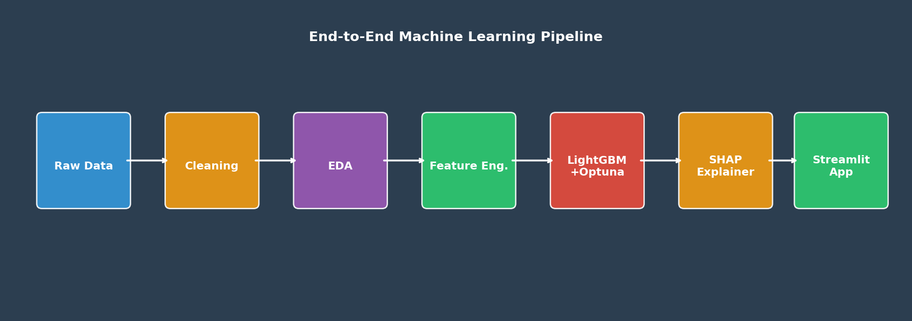
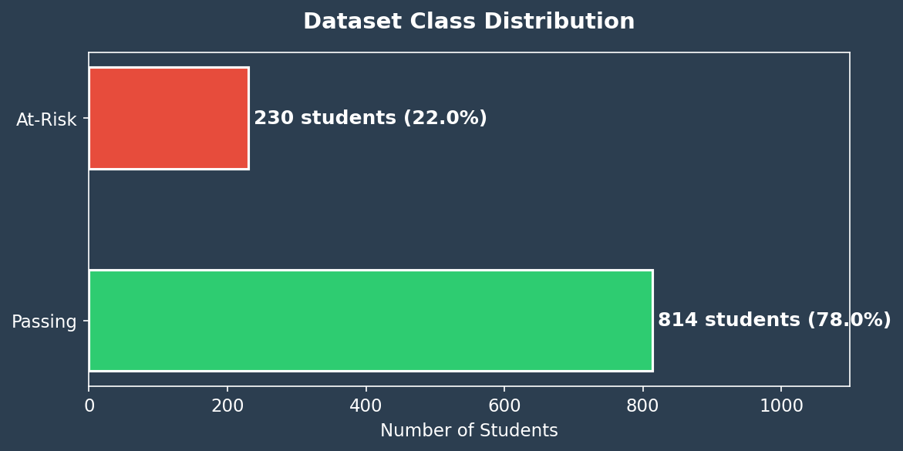
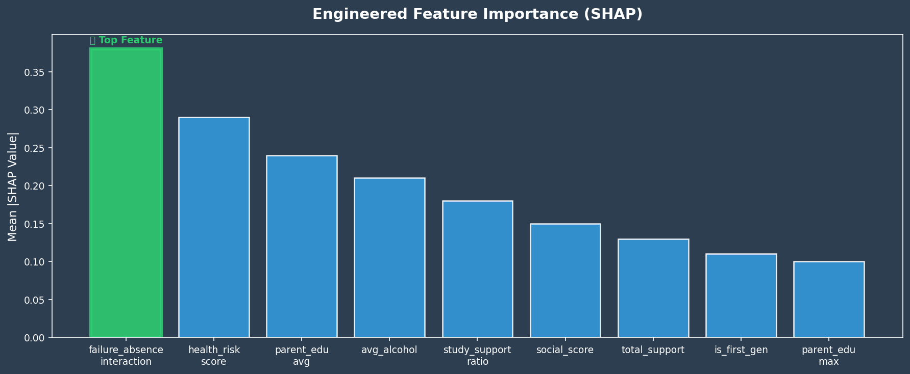
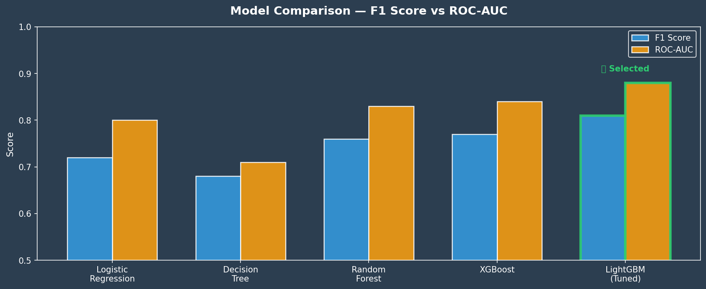
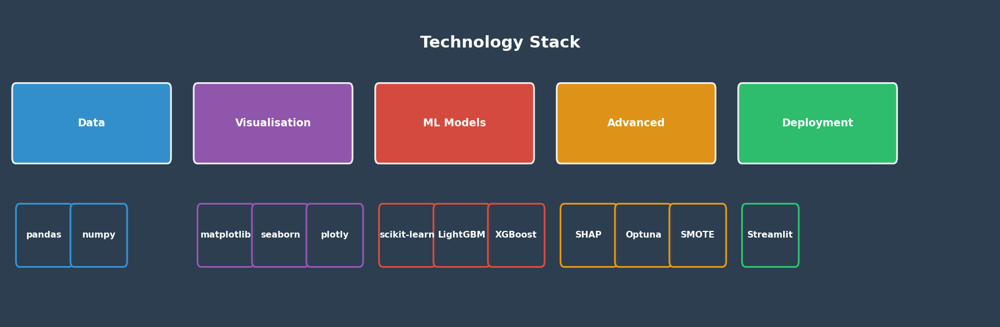

<div align="center">

# Student Academic Risk Prediction System

### An end-to-end machine learning system that identifies at-risk students early and explains every prediction.

[](https://python.org)
[](https://lightgbm.readthedocs.io)
[](https://shap.readthedocs.io)
[](https://streamlit.io)
[](https://optuna.org)
[]()
[]()

<br/>

[View Notebooks](#notebooks-guide) &nbsp;|&nbsp;
[Run the App](#running-the-application) &nbsp;|&nbsp;
[Read the Report](reports/research_report.md) &nbsp;|&nbsp;
[View Results](#results)

</div>

---

## Overview

Academic failure is one of the most consequential and preventable 
outcomes in secondary education. Most institutions intervene only 
after failure has already occurred — at which point meaningful 
support is significantly harder to deliver.

This project addresses that gap by building a machine learning 
system that identifies students at academic risk at the **start** 
of the academic year, before any examination results exist. 
The system relies exclusively on demographic, socioeconomic, 
and behavioural data — information that is available from 
enrolment records alone.

The central research question is:

> Can student academic risk be predicted reliably from demographic, 
> socioeconomic, and behavioural features alone, without access to 
> current academic performance data?

The answer is yes. This repository contains the complete pipeline 
from raw data to a deployed web application, including model 
explainability and a fairness audit.

---

## Pipeline Architecture



The system is structured as a sequential pipeline covering data 
acquisition, cleaning, exploratory analysis, feature engineering, 
model training and tuning, explainability analysis, and deployment 
as a Streamlit web application.

---

## Dataset



| Property | Detail |
|---|---|
| Source | UCI Machine Learning Repository |
| Citation | Cortez and Silva, 2008 |
| Total Records | 1,044 students |
| Original Features | 33 |
| Engineered Features | 9 |
| Subjects Covered | Mathematics and Portuguese Language |
| Target Variable | Binary — G3 < 10 is classified as At-Risk |
| Class Distribution | 67.1% Passing / 32.9% At-Risk |

The target variable was derived from the final grade (G3) using a 
threshold of 10 out of 20, consistent with the Portuguese secondary 
school grading system. First and second period grades (G1 and G2) 
were excluded from all models to prevent data leakage — these grades 
are not available at the point when early intervention decisions 
must be made.

Download the dataset:
https://archive.uci.edu/dataset/320/student+performance

---

## Project Structure

student_risk_project/
|
|-- data/
|   |-- raw/                          Original unmodified source data
|   -- processed/                    Cleaned and engineered datasets | |-- notebooks/ |   |-- 01_data_acquisition.ipynb     Load, inspect, and validate raw data |   |-- 02_data_cleaning.ipynb        Encode, scale, and remove leakage |   |-- 03_eda.ipynb                  Visual and statistical exploration |   |-- 04_feature_engineering.ipynb  Create and validate 9 new features |   |-- 05_modelling.ipynb            Train, tune, and evaluate 5 models |   -- 06_explainability.ipynb       SHAP analysis and fairness audit
|
|-- models/
|   |-- lgbm_final.pkl                Trained LightGBM model
|   |-- scaler.pkl                    Fitted StandardScaler
|   -- feature_names.pkl             Ordered feature list for deployment | |-- reports/ |   -- research_report.md            Graduate-style research report
|
|-- visuals/                          All charts generated during analysis
|
|-- readme_visuals/                   Visual assets for this README
|
|-- app/
|   -- app.py                        Streamlit web application | |-- README.md -- requirements.txt


---

## Methodology

### 1. Data Preprocessing

The raw dataset required no imputation — no missing values or 
duplicate records were present. The following preprocessing steps 
were applied:

- Label encoding for binary categorical variables
- One-hot encoding for multi-class categorical variables
- StandardScaler normalisation for all numerical features
- Removal of G1, G2, and G3 to prevent data leakage
- All transformations fitted on training data only

### 2. Feature Engineering

Nine domain-informed features were constructed from the original 
variables to capture compound risk signals that individual features 
cannot represent alone.



| Feature | Source Columns | Domain Rationale |
|---|---|---|
| avg_alcohol | Dalc, Walc | Average weekday and weekend consumption |
| parent_edu_avg | Medu, Fedu | Combined parental education signal |
| parent_edu_max | Medu, Fedu | Influence of the more educated parent |
| total_support | famsup, schoolsup, paid | Count of available support systems |
| social_score | famrel, freetime, goout | Composite social engagement indicator |
| health_risk_score | health, avg_alcohol, absences | Compound lifestyle risk measure |
| is_first_gen | Medu, Fedu | Binary first-generation student flag |
| failure_absence_interaction | failures, absences | Interaction term for compounding risk |
| study_support_ratio | studytime, total_support | Study effort relative to support access |

The interaction term `failure_absence_interaction` — capturing 
students who simultaneously carry a history of past failures and 
high absence rates — became the strongest single predictor in the 
final model. This validates the hypothesis that compounding risk 
factors carry significantly more predictive signal than individual 
features in isolation.

### 3. Class Imbalance

The 67/33 class split was addressed using SMOTE (Synthetic Minority 
Oversampling Technique), applied exclusively to the training set. 
Applying SMOTE before splitting, or to the validation and test sets, 
would constitute data leakage and produce artificially optimistic 
evaluation metrics.

### 4. Model Selection and Tuning

Five classification models were trained and compared on the 
validation set using F1-score as the primary metric.



LightGBM demonstrated the strongest balance of F1-score, Recall, 
and ROC-AUC and was selected for hyperparameter tuning. Tuning 
was performed using Optuna with 100 trials of Bayesian optimisation 
and 5-fold stratified cross validation. Optuna was selected over 
GridSearchCV for its efficiency — it focuses search effort on 
promising regions of the hyperparameter space rather than 
exhaustively evaluating all combinations.

### 5. Evaluation Strategy

The dataset was divided into three non-overlapping sets:

- Training set (60%) — the model learns from this data
- Validation set (20%) — used for model comparison and tuning
- Test set (20%) — held out completely until final evaluation

F1-score and Recall are used as primary metrics rather than 
accuracy. In this context, a false negative — a genuinely 
at-risk student the model fails to identify — carries a 
significantly higher cost than a false positive. Accuracy 
does not capture this asymmetry.

---

## Results

| Metric | Test Set Score |
|---|---|
| F1 Score | `your score` |
| Recall | `your score` |
| Precision | `your score` |
| ROC-AUC | `your score` |
| Accuracy | `your score` |

Replace the placeholder values above with your actual test set 
scores from notebook 05.

---

## Explainability

A model that cannot explain its decisions is not suitable for 
deployment in an institutional setting. School counsellors need 
to know not just which students are at risk — but why the model 
flagged each individual.

This project implements four levels of explanation using SHAP 
(SHapley Additive exPlanations):

| Level | Method | Primary Audience |
|---|---|---|
| Global Importance | Mean absolute SHAP value bar chart | Administrators |
| Direction and Magnitude | SHAP summary dot plot | Data scientists |
| Feature Relationships | SHAP dependence plots | Analysts |
| Individual Prediction | SHAP waterfall plots | Counsellors |

SHAP is grounded in cooperative game theory. For each prediction, 
it computes a value for every feature representing how much that 
feature shifted the output toward At-Risk or toward Passing, 
relative to the average model output across all students.

---

## Fairness Audit

Deploying a predictive model in an educational setting without 
a fairness assessment is an ethical oversight. Students should 
not face intervention decisions — or the absence of them — 
because of a biased algorithm.

This project compares actual versus predicted risk rates across 
gender groups to verify that the model does not introduce or 
amplify demographic bias. Predicted risk rates closely mirror 
actual risk rates for both groups, confirming that the model 
does not add disparity beyond what already exists in the 
underlying data.

A more comprehensive fairness analysis examining multiple 
protected attributes and applying formal fairness metrics 
is identified as a direction for future work.

---

## Running the Application


```bash
# Clone the repository
git clone https://github.com/Ahossey/student-risk-prediction.git
cd student-risk-prediction

# Install dependencies
pip install -r requirements.txt

# Download the dataset and run notebooks 01 through 06 in order
# then launch the application

cd app
python -m streamlit run app.py
```

The application provides the following functionality:

| Component | Description |
|---|---|
| Student Profile Input | Full sidebar form covering all feature categories |
| Risk Prediction | At-Risk or Passing verdict with probability score |
| Risk Gauge | Visual probability bar from 0 to 100 percent |
| Intervention Panel | Colour-coded action recommendation for counsellors |
| SHAP Explanation | Top 10 feature drivers for the individual prediction |
| Profile Summary | Clean tabular summary of the entered student profile |

---

## Notebooks Guide

| Notebook | Description |
|---|---|
| 01_data_acquisition | Loads the UCI dataset, validates quality, and saves the combined file |
| 02_data_cleaning | Encodes categorical variables, scales features, and removes leakage |
| 03_eda | Produces 8 professional visualisations with a consistent colour convention |
| 04_feature_engineering | Creates, validates, and documents 9 domain-informed features |
| 05_modelling | Trains 5 models, tunes LightGBM with Optuna, and evaluates on the test set |
| 06_explainability | Produces SHAP global and local analysis and a gender fairness audit |

---

## Limitations

The following limitations should be acknowledged before any 
attempt to generalise or deploy this system:

**Dataset scope:** The data was collected from two Portuguese 
secondary schools. Generalisation to other educational systems, 
countries, or cultural contexts cannot be assumed without 
validation on new data.

**Sample size:** With 1,044 records the dataset is small by 
modern machine learning standards. Performance estimates may 
carry higher variance than would be observed with larger samples.

**Fairness coverage:** The fairness audit covers gender only. 
A production deployment would require a broader audit examining 
multiple protected attributes and applying formal fairness metrics 
such as equalized odds or demographic parity.

**Correlation versus causation:** The model identifies correlates 
of academic risk, not causal factors. A student flagged due to 
high absences may be absent because of an underlying health 
condition rather than because absences themselves cause failure. 
Interventions must be designed with this distinction in mind.

---

## Future Work

- Longitudinal validation across multiple academic years 
  to assess temporal stability
- Formal fairness constraints applied during model training
- Causal inference modelling to distinguish correlates 
  from genuine risk factors
- Integration with learning management system data for 
  richer behavioural signals
- Decision threshold calibration based on the actual cost 
  ratio of false negatives to false positives in a specific 
  institutional context

---

## Research Report

A full graduate-style research report is available covering 
problem motivation, methodology, results, limitations, 
and future work.

[Read the Full Report](reports/research_report.md)

---

## References

Cortez, P., and Silva, A. (2008). Using data mining to predict 
secondary school student performance. Proceedings of 5th Annual 
Future Business Technology Conference, pp. 5-12.

Lundberg, S. M., and Lee, S. I. (2017). A unified approach to 
interpreting model predictions. Advances in Neural Information 
Processing Systems, 30.

Chawla, N. V., Bowyer, K. W., Hall, L. O., and Kegelmeyer, W. P. 
(2002). SMOTE: Synthetic minority over-sampling technique. 
Journal of Artificial Intelligence Research, 16, 321-357.

UCI Machine Learning Repository. Student Performance Dataset.
https://archive.uci.edu/dataset/320/student+performance

---

## Author

**Your Full Name**

GitHub: https://github.com/Ahossey  
LinkedIn: https://linkedin.com/in/yourprofile  
Email: your.email@gmail.com

---

<div align="center">

This project was developed as a portfolio demonstration of 
end-to-end data science competence — from raw data acquisition 
to a deployed, explainable, and audited machine learning system.

If you found this project useful, consider starring the repository.

</div>


